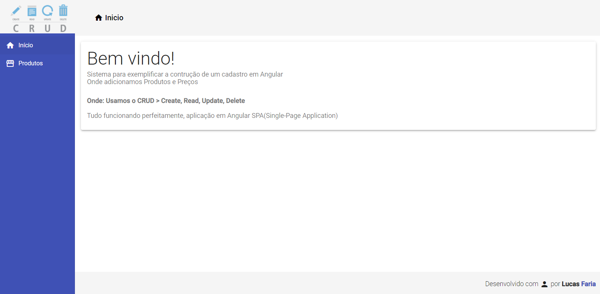

# CRUD-PRODUTOS-Angular-9

Curso Básico de Angular Cod3r do Leonardo Leitão

Objetivos do curso foram 

Desenvolver uma Aplicação com Angular 9

Criar uma Aplicação de Cadastro (CRUD) com Criação, Leitura, Atualização e Exclusão de Produto

Usando os principais conceitos do Angular 9: Componentes, Diretivas, Pipes, Services e muito mais

Aprender Angular na Prática de forma muito objetiva

1°- No BACKEND 
--> Usei o npm i json-server para instalar a dependência do JSON-SERVER
    -Criei o db.json
    -Tabela Products
    -Passando (id, name e price)

2°- No FRONTEND 
--> Criei a pasta usando o ng new frontend --minimal
    -Aceitei a parte de Rotas 'routing' (Y) e usei o CSS normal na segunda pergunta!
    -Usei este comando pois ele já cria todo o projeto automaticamente, então fica bem tranquilo trabalhar com essa opção.

